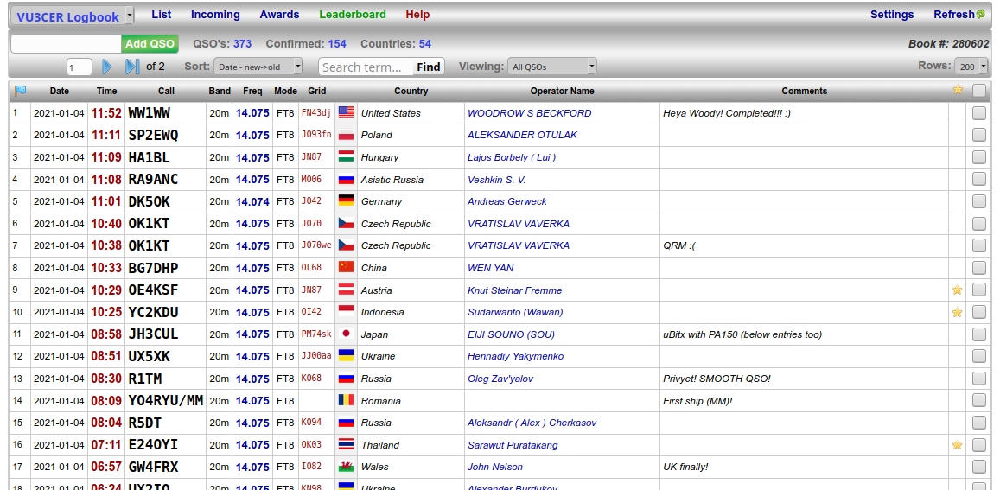

#### LiDi

LiDi is Light-Intuitive-Digital-Audio-Interface for µBITX and other radios. It
is meant to be homebrewed on a `Zero PCB` in under 30 minutes.

Design 2:

Design 1:

Note: All the included designs (and some other ones) were simulated in LTspice,
and then tested on air.

Sample testing setup on a breadboard ;)

Sometimes, a quick shorted digital interface is all you need for a US QSO in
"Solar Minimum" conditions ;)

RX performance is lovely with LiDi - US @ -4.

50 QSOs were done with LiDi designs in a single day!

#### BOM Sources

- [Bourns LM-NP-1001-B1L 600:600 audio transformer](https://in.rsdelivers.com/product/bourns/lm-np-1001-b1l/chassis-mount-audio-transformer/1728110)

- [Bourns LM-NP-1001-B1L 600:600 audio transformer (alt source)](https://www.semikart.com/product/bourns-/LM-NP-1001-B1L/58614)

- [Audio & Signal isolation transformer 600:600 (alt source)](https://www.sunrom.com/p/audio-signal-isolation-transformer-600600)

- [GX-16 4-Pin Metal Aviation Plug Female](https://robu.in/product/gx-16-4-pin-metal-aviation-plug-male-and-female-panel-connector/)

- https://projectpoint.in/ (capacitors, pots, connectors)

- https://www.sunrom.com/ (audio connectors, caps, misc)

- https://www.electronicscomp.com/ (connectors, misc)

- https://www.electroncomponents.com/ (connectors, audio cables, misc)

- https://www.diyaudiocart.com/ (nice quality caps)

- [USB Sound Card](https://robu.in/product/5-1-channel-usb-sound-card-for-raspberry-pi-and-computers/)

#### µBITX Aviation Connector Pinout

Clockwise from the notch on the GX-16 connector:

Black + Blue -> Ground

Brown + "Red" -> Speaker

Anti-clockwise from the notch:

Purple -> Mic (TIP)

Orange -> PTT

Brown + "Red" -> Speaker

https://www.hfsignals.com/index.php/ubitx-wire-up/

https://source.android.com/devices/accessories/headset/plug-headset-spec

#### Tips

- Use KD8CEC firmware for µBITX. Use https://github.com/reedbn/ubitxv6 for
  µBITX v6.

- Configure WSJT-X for µBITX using details from the following article.

  http://www.hamskey.com/2018/01/wjst-x-configuration-for-ubitx.html

- For BITX40, use a suitable firmware from https://github.com/amunters.

  I have no experience with BITX40 though.
